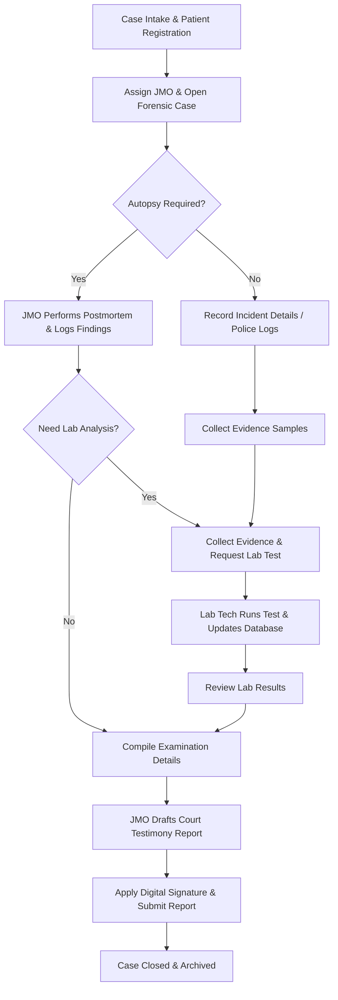
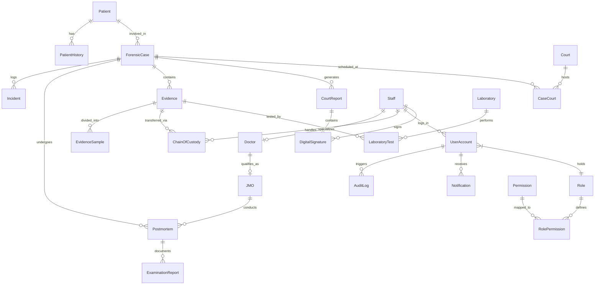
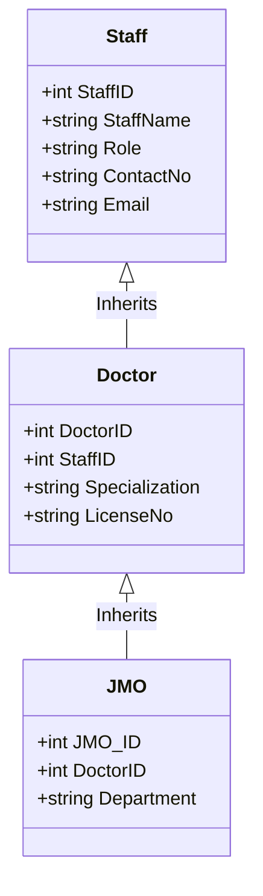

# Database System Report: Forensic Medical Department Management System (Forensa)

**Design and Development of a Complete Database System for a Forensic Medical Department**

---

## Cover Page

*   **University Name:** University of Peradeniya
*   **Faculty:** Faculty of Engineering
*   **Department:** Department of Computer Engineering
*   **Course Code & Course Title:** CO327 - Database Systems
*   **Mini Project Title:** Design and Development of a Complete Database System for a Forensic Medical Department (Forensa)
*   **Group Number:** Group 12
*   **Student Names and Registration Numbers:**
    *   Sasvi Gunasiri (E/22/120)
    *   Himasha Pathirana (E/22/001)
    *   Nethmi Pamosha (E/22/027)
*   **Lecturer:** Dr. Asitha Bandaranayake, Dr. Dhammika Elkaduwe
*   **Submission Date:** July 20, 2026

---

## Declaration

We hereby declare that the work presented in this report is our own original work and has not been submitted, in whole or in part, to any other institution for any academic award or qualification. All sources of information and literature utilized in this project have been duly acknowledged.

*Student Signatures:*
*   *Sasvi Gunasiri (E/22/120)*: `[Signed Digitally]`
*   *Himasha Pathirana (E/22/001)*: `[Signed Digitally]`
*   *Nethmi Pamosha (E/22/027)*: `[Signed Digitally]`

---

## Acknowledgement

We express our sincere gratitude to our course lecturers, Dr. Asitha Bandaranayake and Dr. Dhammika Elkaduwe, as well as the lab instructors and teaching assistants of the Department of Computer Engineering, University of Peradeniya. Their guidance, technical insights, and structured course material provided us with the foundation necessary to design and implement this database system. 

We also extend our appreciation to the Ministry of Health and the judicial medical officers whose public documentation on forensic procedures guided our requirement gathering process.

---

## Abstract

**Background:** Forensic medical departments are critical links in the judicial system, providing objective scientific analysis of evidence and autopsy findings. Traditionally, these departments manage massive volumes of files containing sensitive victim records, postmortem details, chain of custody logs, and laboratory request slips manually using physical books and folders.

**Problem:** Manual record keeping is highly vulnerable to physical deterioration, misplacement, unauthorized access, and transcription errors. Furthermore, extracting statistical insights (e.g., monthly case types, average autopsy times) or searching through historic patient records is extremely slow and tedious, delaying court proceedings and hindering justice.

**Objectives:** The objective of this project is to design and develop a secure, centralized, and computerized database system named **Forensa**. The system aims to automate patient registration, forensic case documentation, JMO assignment, evidence tracking, lab testing requests, and court report generation.

**Methodology:** We adopted a relational database design methodology. First, we conducted a requirement elicitation phase to model forensic workflows. We created an Entity-Relationship Diagram (ERD), which was normalized to the Third Normal Form (3NF) to prevent data redundancy and anomalies. We then developed a relational database in MySQL. The system architecture uses a three-tier model: a client web interface, a FastAPI service layer, and a MySQL backend. Secure access control was established using Role-Based Access Control (RBAC) and mock Bearer token authentication.

**Technologies Used:** MySQL (Database), FastAPI (Python Web Framework), HTML5, CSS3, and JavaScript (Frontend client).

**Summary of Results:** The database implements 26 tables, enforcing relational constraints, cascaded deletes, and integrity checks. The system features a responsive, tabbed administrative dashboard tailored to specific roles (Administrator, JMO, Doctor, Lab Technician, Evidence Officer). Testing demonstrated successful transaction handling, proper permission enforcement, query execution, and secure backup/recovery operations.

**Keywords:** Forensic Case Management, Database System, FastAPI, Role-Based Access Control (RBAC), Chain of Custody, Postmortem Examination.

---

## Table of Contents

1.  [Chapter 1 – Introduction](#chapter-1--introduction)
    *   1.1 Background
    *   1.2 Problem Statement
    *   1.3 Objectives
    *   1.4 Scope of the Project
    *   1.5 Significance of the Study
    *   1.6 Technologies Used
2.  [Chapter 2 – Requirement Analysis](#chapter-2--requirement-analysis)
    *   2.1 Existing System
    *   2.2 Problems in Existing System
    *   2.3 Proposed System
    *   2.4 Stakeholders
    *   2.5 Functional Requirements
    *   2.6 Non-functional Requirements
    *   2.7 Use Cases
    *   2.8 Workflow / Business Process
3.  [Chapter 3 – Database Design](#chapter-3--database-design)
    *   3.1 Entity Identification
    *   3.2 ER Diagram
    *   3.3 Enhanced ER Diagram
    *   3.4 Relational Schema
    *   3.5 Data Dictionary
    *   3.6 Primary Keys
    *   3.7 Foreign Keys
    *   3.8 Integrity Constraints
    *   3.9 Normalization
4.  [Chapter 4 – Database Implementation](#chapter-4--database-implementation)
    *   4.1 DBMS Used
    *   4.2 Database Creation
    *   4.3 Table Creation
    *   4.4 Constraints
    *   4.5 Indexes
    *   4.6 Views
    *   4.7 Stored Procedures
    *   4.8 Triggers
    *   4.9 Sample Data
5.  [Chapter 5 – System Development](#chapter-5--system-development)
    *   5.1 System Architecture
    *   5.2 Login Module
    *   5.3 Patient Management
    *   5.4 Case Management
    *   5.5 Postmortem Module
    *   5.6 Evidence Management
    *   5.7 Court Report Module
    *   5.8 Staff Management
    *   5.9 Report Generation
    *   5.10 Dashboard
    *   5.11 User Authentication
6.  [Chapter 6 – Testing](#chapter-6--testing)
    *   6.1 Test Plan
    *   6.2 Test Cases
    *   6.3 Validation Testing
    *   6.4 SQL Query Testing
    *   6.5 Backup and Recovery
7.  [Chapter 7 – Reports](#chapter-7--reports)
8.  [Chapter 8 – Security](#chapter-8--security)
9.  [Chapter 9 – Challenges and Future Improvements](#chapter-9--challenges-and-future-improvements)
10. [Chapter 10 – Conclusion](#chapter-10--conclusion)
11. [References](#references)
12. [Appendices](#appendices)
    *   Appendix A – SQL Scripts
    *   Appendix B – Sample Forms
    *   Appendix C – Sample Reports
    *   Appendix D – User Manual
    *   Appendix E – Test Results
    *   Appendix F – Source Code Structure
    *   Appendix G - Software Requirement Specification (SRS)
13. [Individual Contribution](#individual-contribution)
14. [Project Timeline](#project-timeline)
15. [Checklist Before Submission](#checklist-before-submission)

---

## List of Figures

*   Figure 2.1: Use Case Diagram for the Forensa System
*   Figure 2.2: Business Process Flowchart
*   Figure 3.1: Complete Entity Relationship Diagram (ERD)
*   Figure 3.2: Enhanced ER Diagram (Specialization/Generalization)
*   Figure 5.1: 3-Tier System Architecture Diagram
*   Figure 5.2: Authentication & Token Authorization Sequence
*   Figure 7.1: Monthly Case Load Distribution Chart

---

## List of Tables

*   Table 2.1: Use Case Description - Create Forensic Case
*   Table 2.2: Use Case Description - Manage Evidence
*   Table 2.3: Use Case Description - Input Laboratory Test Result
*   Table 3.1: Data Dictionary - Patient Table
*   Table 3.2: Data Dictionary - ForensicCase Table
*   Table 3.3: Data Dictionary - Postmortem Table
*   Table 3.4: Data Dictionary - Evidence Table
*   Table 3.5: Data Dictionary - ChainOfCustody Table
*   Table 3.6: Data Dictionary - UserAccount Table
*   Table 3.7: Relational Constraints Mapping
*   Table 6.1: Functional Testing Results Matrix
*   Table 6.2: Validation Rules Matrix

---

## List of Abbreviations

*   **SRS**: Software Requirements Specification
*   **ERD**: Entity Relationship Diagram
*   **DBMS**: Database Management System
*   **SQL**: Structured Query Language
*   **JMO**: Judicial Medical Officer
*   **UML**: Unified Modeling Language
*   **RBAC**: Role-Based Access Control
*   **REST**: Representational State Transfer
*   **API**: Application Programming Interface
*   **CORS**: Cross-Origin Resource Sharing
*   **PK**: Primary Key
*   **FK**: Foreign Key
*   **UNF**: Unnormalized Form
*   **1NF**: First Normal Form
*   **2NF**: Second Normal Form
*   **3NF**: Third Normal Form
*   **NIC**: National Identity Card
*   **DOB**: Date of Birth
*   **JWT**: JSON Web Token
*   **SLMC**: Sri Lanka Medical Council

---

## Chapter 1 – Introduction

### 1.1 Background
Forensic medicine serves as a bridge between medical science and the judicial system. They are responsible for conducting postmortem examinations (autopsies), analyzing physical injuries on living victims, managing forensic evidence collected from crime scenes, conducting laboratory tests (toxicology, DNA, histology), and compiling objective reports used by courts of law. 

In Sri Lanka, forensic medicine is primarily practiced by Judicial Medical Officers (JMOs) and Consultant Forensic Pathologists. Currently, many departments operate using manual registers. Patient demographics, case diaries, evidence registers, and autopsy findings are recorded by hand in paper books. While this process is long-established, it introduces delays in high-throughput departments, making tracking and indexing cases a major operational challenge.

### 1.2 Problem Statement
The reliance on manual record keeping within the forensic medical department creates several critical challenges:
*   **Paper Records Vulnearibility:** Physical books are susceptible to wear, accidental water/fire damage, and insect decay. Loss of a single autopsy logbook can ruin pending homicide trials.
*   **Search Limitations:** Finding a victim's past medical history or checking prior cases associated with a particular suspect requires searching manually through dusty archive rooms. This process is time-consuming and inefficient.
*   **Confidentiality Risks:** Physical records are difficult to restrict. Unauthorized administrative staff or visitors can potentially view highly confidential autopsy reports and victim details.
*   **Inefficient Report Generation:** Compiling monthly statistical reports for the Ministry of Health or listing outstanding court reports requires counting cases manually.
*   **Evidence Custody Tracking:** Physical logs representing the chain of custody are prone to tampering, omission, or loss of custody tags, which can compromise the admissibility of evidence in court.

### 1.3 Objectives
#### General Objective
To design, implement, and validate a secure, centralized, and computerized relational database system (Forensa) that automates and digitizes case file creation, patient registration, autopsy documentation, laboratory analysis requests, evidence tracking, and court report generation.

#### Specific Objectives
1.  Formulate a normalized relational schema (up to 3NF) representing all core entities and workflows of a forensic department.
2.  Deploy a robust MySQL database schema incorporating primary keys, foreign keys, cascade triggers, check constraints, and unique fields.
3.  Establish Role-Based Access Control (RBAC) to ensure confidentiality, restricting data access based on defined roles.
4.  Develop a FastAPI backend to expose secure REST APIs for database operations.
5.  Create a clean, responsive, government-portal-style web frontend for user interaction.
6.  Incorporate automatic audit logging of critical actions (logins, case creation, report generation) to maintain security audit trails.
7.  Design automated reports and structured queries to verify system capabilities.

### 1.4 Scope of the Project
*   **Inclusions:**
    *   Digitized Patient Registration and Search.
    *   Forensic Case Intake and status tracking (Active, In Progress, Completed).
    *   Staff, Doctor, and JMO profile directories.
    *   Autopsy record entries (Postmortem findings, cause of death).
    *   Evidence collection records, storage allocation, and Chain of Custody transfers.
    *   Laboratory request assignments and result documentation.
    *   Court Report generation and status tracking.
    *   Role-based user portal rendering layouts dynamically based on permissions.
    *   System audit logging and database backup records.
*   **Exclusions:**
    *   The system does *not* interface with external police/court networks.
    *   Financial accounting, salary disbursements, and HR payroll features are excluded.
    *   The software does not perform automated physical DNA/toxicology analyses; it is designed to store findings generated by lab technicians.

### 1.5 Significance of the Study
The Forensa system replaces physical paper logs with a computerized system, ensuring that:
1.  **Chain of Custody is legally bulletproof:** The database logs the time, staff member, and action taken for every evidence transfer, preventing tamper attempts.
2.  **Case information is readily searchable:** JMOs can retrieve past cases or patient medical histories instantly using SQL index queries.
3.  **Data integrity is maintained:** Referential integrity rules prevent orphan reports or dangling postmortem files.
4.  **Strict Security Compliance:** Role-Based Access Control ensures that administrative staff cannot access sensitive autopsy details, preserving victim privacy.

### 1.6 Technologies Used
*   **Database Management System:** MySQL Community Server 8.0+ (Relational engine enforcing transactional ACID compliance).
*   **Backend Framework:** FastAPI (Python 3.10) for high-performance REST APIs.
*   **Database Driver:** `mysql-connector-python` for executing parameterized SQL statements and handling transaction commits.
*   **Environment Configuration:** `python-dotenv` for isolating database credentials.
*   **Frontend Client:** HTML5, CSS3 (Vanilla style), and asynchronous Vanilla JavaScript (ES6) interacting with backend endpoints via AJAX/Fetch API.

---

## Chapter 2 – Requirement Analysis

### 2.1 Existing System
The existing system relies on paper registers. Upon case intake, a clerk records basic patient details, police station reports, and case numbers in a ledger. JMOs carry paper clipboards to perform autopsies, writing down findings and causes of death. Physical evidence is placed in plastic bags with paper tags. Handovers are signed on paper logbooks. Lab requests are written on slips and hand-delivered, and results are returned via post. Court testimonies are drafted on typewriters or word processors, printed, signed, and hand-delivered.

### 2.2 Problems in Existing System
1.  **Risk of Physical Damage:** Fire, water damage, or decay can destroy files.
2.  **Slow Search and Retrieval:** Searching through files takes hours or days.
3.  **Lack of Security and Privacy:** Paper files can be accessed by unauthorized personnel.
4.  **Weak Chain of Custody Audits:** Paper tags can be easily altered, detached, or lost.
5.  **Inconsistent Report Assembly:** Compiling reports requires manual review of multiple ledgers.

### 2.3 Proposed System
The proposed computerized database system, **Forensa**, provides a centralized repository. A secure web interface allows authenticated users to execute tasks based on their roles:
*   **JMOs & Doctors:** View assigned cases, update autopsy details, record cause of death, and draft court reports.
*   **Lab Technicians:** View pending test requests, enter analysis results, and update status.
*   **Evidence Officers:** Log evidence details, record transfers, and update custody logs.
*   **Administrators:** Manage staff and user accounts, review audit logs, and trigger backups.

### 2.4 Stakeholders
*   **Patients/Victims:** Individuals whose records are kept securely.
*   **Judicial Medical Officers (JMOs):** High-level medical experts who perform examinations and write court testimonies.
*   **Doctors:** Assisting medical staff who observe case progress.
*   **Laboratory Staff (Technicians):** Analyze specimens and record findings.
*   **Clerical/Evidence Officers:** Log case intakes and manage evidence storage.
*   **Court Officials / Law Enforcement:** Receive finalized court reports.
*   **System Administrators:** Monitor system health, execute backups, and audit access.

### 2.5 Functional Requirements
*   **FR-01: User Authentication:** Users must register, log in, and obtain a secure token.
*   **FR-02: Role-Based Authorization:** The system must restrict UI elements and API endpoints based on roles (Administrator, JMO, Doctor, Lab Technician, Evidence Officer).
*   **FR-03: Patient Intake:** Allow registration of patient demographics (Name, NIC, DOB, Gender, Address, Contact).
*   **FR-04: Case Registration:** Create new cases with unique case numbers, types, open dates, and descriptions.
*   **FR-05: JMO Case Assignment:** Assign a JMO to a case, which automatically creates a Postmortem entry.
*   **FR-06: Evidence Registry:** Log evidence items, assign type, specify description, and allocate storage locations.
*   **FR-07: Chain of Custody Log:** Automatically record custody transfers, tracking the date, handler, and action taken.
*   **FR-08: Laboratory Test Ordering & Recording:** Request lab tests, assign an analyst, and log results.
*   **FR-09: Postmortem Documentation:** Record autopsy dates, findings, and cause of death.
*   **FR-10: Court Report Submission:** Generate court reports, track draft/submitted status, and sign reports.
*   **FR-11: Audit Logging:** Log actions (Logins, Case additions, Evidence transfers) in the database with timestamps and user IDs.

### 2.6 Non-functional Requirements
*   **NFR-01: Security:** Passwords must be validated and authenticated via Bearer tokens.
*   **NFR-02: Performance:** Database queries should execute in less than 500ms under standard loads.
*   **NFR-03: Reliability:** Database must support transactional ACID properties. Any failure during multi-table writes (e.g., case creation and JMO assignment) must rollback.
*   **NFR-04: Integrity:** Restrict deletes on referenced records (e.g., cannot delete a patient if they have open forensic cases).
*   **NFR-05: Usability:** Responsive web client matching a professional government aesthetic.

### 2.7 Use Cases

```mermaid
usecaseDiagram
    actor Admin
    actor JMO
    actor LabTech as "Lab Technician"
    actor EvidOff as "Evidence Officer"
    
    Admin --> (Manage User Accounts)
    Admin --> (View System Audit Logs)
    Admin --> (Manage Case Intake)
    
    JMO --> (Manage Case Intake)
    JMO --> (Perform Postmortem Examination)
    JMO --> (Generate Court Reports)
    JMO --> (View Case Records)
    
    EvidOff --> (Manage Case Intake)
    EvidOff --> (Log Evidence Items)
    EvidOff --> (Transfer Chain of Custody)
    
    LabTech --> (Perform Laboratory Tests)
    LabTech --> (View Lab Worklist)
```

#### Use Case Descriptions
##### Table 2.1: Use Case Description - Create Forensic Case
| Field | Description |
| :--- | :--- |
| **Use Case Name** | Create Forensic Case |
| **Actors** | System Administrator, Judicial Medical Officer |
| **Pre-conditions** | Actor is authenticated and possesses the `Manage Cases` permission. |
| **Basic Flow** | 1. Actor clicks "+ Add New Case" button.<br>2. System displays case creation form.<br>3. Actor inputs Case Number, Title, Case Type, Opened Date, Assigned JMO, and description.<br>4. System validates inputs (checks that Case Number is unique).<br>5. System inserts case into `ForensicCase` table.<br>6. System assigns JMO and creates a `Postmortem` record.<br>7. System records action in `AuditLog` table. |
| **Post-conditions** | Forensic case is saved and assigned. |

##### Table 2.2: Use Case Description - Manage Evidence
| Field | Description |
| :--- | :--- |
| **Use Case Name** | Log and Track Evidence |
| **Actors** | Evidence Officer |
| **Pre-conditions** | Evidence Officer is authenticated and has `Manage Evidence` permission. |
| **Basic Flow** | 1. Officer selects case and enters evidence details (type, storage location, collection date).<br>2. System validates and records evidence in `Evidence` table.<br>3. System prompts creation of the first `ChainOfCustody` record (Action: 'Collected').<br>4. Officer submits form. |
| **Post-conditions** | Evidence is recorded and custody status is updated. |

### 2.8 Workflow / Business Process



---

## Chapter 3 – Database Design

### 3.1 Entity Identification
*   **Patient:** Demographic details of victims/subjects.
*   **PatientHistory:** Medical background and past cases.
*   **ForensicCase:** Legal case files.
*   **Incident:** Place, date, and description of the crime scene.
*   **Staff:** Staff members (JMOs, Techs, Admins, Officers).
*   **Doctor:** Subclass of Staff specialized in medical diagnostics.
*   **JMO (Judicial Medical Officer):** Doctors qualified to perform autopsies.
*   **Postmortem:** Autopsy findings and cause of death.
*   **ExaminationReport:** Official write-up of postmortem results.
*   **Evidence:** Physical items collected during investigations.
*   **EvidenceSample:** Specific specimens taken from evidence.
*   **ChainOfCustody:** Audit log of evidence transfers.
*   **Laboratory:** Testing facilities.
*   **LaboratoryTest:** Specific analysis run on evidence.
*   **CourtReport:** Final reports prepared for judicial review.
*   **Court:** Courts requesting testimony.
*   **CaseCourt:** Details of scheduled hearings.
*   **UserAccount:** Security logins.
*   **Role / Permission / RolePermission:** RBAC models.
*   **AuditLog:** Records system activity.
*   **Notification:** Notifications for users.
*   **DigitalSignature:** Verification signatures.
*   **BackupRecord:** Database backups.

### 3.2 ER Diagram



### 3.3 Enhanced ER Diagram (Specialization / Generalization)



### 3.4 Relational Schema
*   `Patient` (**PatientID**, FullName, NIC, DateOfBirth, Gender, Address, ContactNo, RegistrationDate)
*   `PatientHistory` (**HistoryID**, *PatientID*, MedicalHistory, PreviousCases)
*   `ForensicCase` (**CaseID**, *PatientID*, CaseNumber, CaseType, IncidentDate, IncidentLocation, CaseDescription, Status)
*   `Incident` (**IncidentID**, *CaseID*, IncidentType, PoliceStation, Description)
*   `Staff` (**StaffID**, StaffName, Role, ContactNo, Email)
*   `Doctor` (**DoctorID**, *StaffID*, Specialization, LicenseNo)
*   `JMO` (**JMO_ID**, *DoctorID*, Department)
*   `Postmortem` (**PostmortemID**, *CaseID*, *JMO_ID*, ExaminationDate, Findings, CauseOfDeath)
*   `ExaminationReport` (**ReportID**, *PostmortemID*, ReportDetails, CreatedDate)
*   `Evidence` (**EvidenceID**, *CaseID*, EvidenceType, Description, StorageLocation, CollectedDate)
*   `EvidenceSample` (**SampleID**, *EvidenceID*, SampleType, SampleStatus)
*   `ChainOfCustody` (**CustodyID**, *EvidenceID*, *StaffID*, TransferDate, ActionTaken)
*   `Laboratory` (**LabID**, LabName, Location)
*   `LaboratoryTest` (**TestID**, *EvidenceID*, *LabID*, TestType, Result, TestDate)
*   `CourtReport` (**CourtReportID**, *CaseID*, SubmissionDate, Status, ReportContent)
*   `Court` (**CourtID**, CourtName, Location)
*   `CaseCourt` (**CaseCourtID**, *CaseID*, *CourtID*, HearingDate)
*   `UserAccount` (**UserID**, Username, Password, UserRole, *StaffID*)
*   `Role` (**RoleID**, RoleName)
*   `Permission` (**PermissionID**, PermissionName)
*   `RolePermission` (**RolePermissionID**, *RoleID*, *PermissionID*)
*   `AuditLog` (**AuditID**, *UserID*, Action, ActionDate)
*   `Notification` (**NotificationID**, *UserID*, Message, CreatedDate, Status)
*   `DigitalSignature` (**SignatureID**, *ReportID*, *SignedBy*, SignatureData, SignedDate)
*   `BackupRecord` (**BackupID**, BackupDate, Location, Status)

### 3.5 Data Dictionary

#### Table 3.1: Data Dictionary - Patient Table
| Attribute | Data Type | Size | Description | Constraints |
| :--- | :--- | :--- | :--- | :--- |
| `PatientID` | INT | Auto | Unique identifier for patient | PRIMARY KEY, AUTO_INCREMENT |
| `FullName` | VARCHAR | 100 | Complete legal name | NOT NULL |
| `NIC` | VARCHAR | 20 | National Identity Card number | UNIQUE, NULL |
| `DateOfBirth` | DATE | - | Date of birth | NULL |
| `Gender` | VARCHAR | 10 | Patient gender (Male/Female/Other) | NULL |
| `Address` | VARCHAR | 255 | Permanent residential address | NULL |
| `ContactNo` | VARCHAR | 15 | Telephone number | NULL |
| `RegistrationDate`| DATE | - | Date registered in system | NULL |

#### Table 3.2: Data Dictionary - ForensicCase Table
| Attribute | Data Type | Size | Description | Constraints |
| :--- | :--- | :--- | :--- | :--- |
| `CaseID` | INT | Auto | Unique identifier for case | PRIMARY KEY, AUTO_INCREMENT |
| `PatientID` | INT | - | Reference to victim | FOREIGN KEY references Patient |
| `CaseNumber` | VARCHAR | 50 | Unique legal reference code | UNIQUE, NOT NULL |
| `CaseType` | VARCHAR | 50 | Classification (e.g., Homicide) | NOT NULL |
| `IncidentDate` | DATE | - | Date incident occurred | NULL |
| `IncidentLocation`| VARCHAR | 200 | Crime scene location | NULL |
| `CaseDescription` | TEXT | - | Narrative of case | NULL |
| `Status` | VARCHAR | 30 | Case status (e.g., Active) | NOT NULL |

#### Table 3.3: Data Dictionary - Postmortem Table
| Attribute | Data Type | Size | Description | Constraints |
| :--- | :--- | :--- | :--- | :--- |
| `PostmortemID` | INT | Auto | Unique identifier for autopsy | PRIMARY KEY |
| `CaseID` | INT | - | Reference to associated case | FOREIGN KEY references ForensicCase |
| `JMO_ID` | INT | - | Reference to examining officer | FOREIGN KEY references JMO |
| `ExaminationDate` | DATE | - | Autopsy examination date | NULL |
| `Findings` | TEXT | - | Pathological findings summary | NULL |
| `CauseOfDeath` | VARCHAR | 255 | Final cause of death | NULL |

#### Table 3.4: Data Dictionary - Evidence Table
| Attribute | Data Type | Size | Description | Constraints |
| :--- | :--- | :--- | :--- | :--- |
| `EvidenceID` | INT | Auto | Unique identifier for evidence item | PRIMARY KEY |
| `CaseID` | INT | - | Associated case file | FOREIGN KEY references ForensicCase |
| `EvidenceType` | VARCHAR | 100 | Classification (e.g., Weapon) | NOT NULL |
| `Description` | TEXT | - | Detail of physical appearance | NULL |
| `StorageLocation` | VARCHAR | 100 | Locker code or room number | NULL |
| `CollectedDate` | DATE | - | Date gathered from scene | NULL |

#### Table 3.5: Data Dictionary - ChainOfCustody Table
| Attribute | Data Type | Size | Description | Constraints |
| :--- | :--- | :--- | :--- | :--- |
| `CustodyID` | INT | Auto | Unique identifier for transfer entry | PRIMARY KEY |
| `EvidenceID` | INT | - | Target evidence item | FOREIGN KEY references Evidence |
| `StaffID` | INT | - | Custodian who received the item | FOREIGN KEY references Staff |
| `TransferDate` | DATE | - | Transfer date | NOT NULL |
| `ActionTaken` | VARCHAR | 100 | Action taken (e.g., 'Stored') | NOT NULL |

#### Table 3.6: Data Dictionary - UserAccount Table
| Attribute | Data Type | Size | Description | Constraints |
| :--- | :--- | :--- | :--- | :--- |
| `UserID` | INT | Auto | Unique user identifier | PRIMARY KEY |
| `Username` | VARCHAR | 50 | Login username | UNIQUE, NOT NULL |
| `Password` | VARCHAR | 255 | Password hash | NOT NULL |
| `UserRole` | VARCHAR | 50 | Security role (e.g. JMO) | NOT NULL |
| `StaffID` | INT | - | Staff details reference | FOREIGN KEY references Staff |

### 3.6 Primary Keys
*   All tables incorporate a surrogate primary key (e.g. `PatientID`, `CaseID`, `CustodyID`) declared as `INT AUTO_INCREMENT PRIMARY KEY`. This ensures fast indexing, join optimization, and consistent record identification.

### 3.7 Foreign Keys
*   Referential integrity is maintained through explicit foreign key constraints:
    *   `PatientHistory(PatientID) REFERENCES Patient(PatientID)`
    *   `ForensicCase(PatientID) REFERENCES Patient(PatientID)`
    *   `Incident(CaseID) REFERENCES ForensicCase(CaseID)`
    *   `Doctor(StaffID) REFERENCES Staff(StaffID)`
    *   `JMO(DoctorID) REFERENCES Doctor(DoctorID)`
    *   `Postmortem(CaseID) REFERENCES ForensicCase(CaseID)`
    *   `Postmortem(JMO_ID) REFERENCES JMO(JMO_ID)`
    *   `Evidence(CaseID) REFERENCES ForensicCase(CaseID)`
    *   `ChainOfCustody(EvidenceID) REFERENCES Evidence(EvidenceID)`
    *   `LaboratoryTest(EvidenceID) REFERENCES Evidence(EvidenceID)`

### 3.8 Integrity Constraints
*   **Domain Integrity:** Handled via specific types (`DATE`, `DATETIME`, `VARCHAR`).
*   **Entity Integrity:** Enforced via `PRIMARY KEY` and `NOT NULL` constraints.
*   **Referential Integrity:** Enforced via `FOREIGN KEY` configurations.
*   **Unique Constraints:** The system enforces uniqueness on `Patient(NIC)`, `ForensicCase(CaseNumber)`, and `UserAccount(Username)`.

### 3.9 Normalization
To illustrate our database normalization, consider an unnormalized representation of case intakes (`UNF_CaseDetails`):

#### UNF (Unnormalized Form)
A single spreadsheet containing:
`CaseID`, `CaseNumber`, `CaseType`, `OpenedDate`, `Description`, `PatientNIC`, `PatientName`, `PatientAddress`, `JMO_Name`, `JMO_Specialization`, `JMO_Department`, `AutopsyFindings`, `AutopsyCauseOfDeath`.

*   **Issues:** Repeating groups, multi-valued fields, and anomalies during updates.

#### 1NF (First Normal Form)
*   **Action:** Eliminate repeating groups, ensure all attributes are atomic, and identify a primary key.
*   **Result:** The table has a primary key `CaseNumber`. Every row has atomic values:

`CaseDetails` (**CaseNumber**, CaseType, OpenedDate, Description, PatientNIC, PatientName, PatientAddress, JMO_Name, JMO_Specialization, JMO_Department, AutopsyFindings, AutopsyCauseOfDeath)

*   **Remaining Issues:** Redundancy. If a patient is involved in multiple cases, their name and address are repeated. If a JMO performs multiple autopsies, their specialization and department are repeated (Partial dependencies).

#### 2NF (Second Normal Form)
*   **Action:** Eliminate partial key dependencies by separating entities.
*   **Result:** Split the table into three distinct relation schemas:
    1.  `Patient` (**PatientNIC**, PatientName, PatientAddress)
    2.  `JMO` (**JMO_Name**, JMO_Specialization, JMO_Department)
    3.  `ForensicCase` (**CaseNumber**, CaseType, OpenedDate, Description, *PatientNIC*, *JMO_Name*, AutopsyFindings, AutopsyCauseOfDeath)

*   **Remaining Issues:** Transitive dependencies. If the JMO's department changes, we must update all entries associated with that JMO.

#### 3NF (Third Normal Form)
*   **Action:** Eliminate transitive dependencies (non-key attributes depending on other non-key attributes).
*   **Result:** Extract JMO and Staff entities and introduce surrogate integer IDs for efficient joins:
    *   `Patient` (**PatientID**, FullName, NIC, Address)
    *   `Staff` (**StaffID**, StaffName, Role)
    *   `Doctor` (**DoctorID**, *StaffID*, Specialization, LicenseNo)
    *   `JMO` (**JMO_ID**, *DoctorID*, Department)
    *   `ForensicCase` (**CaseID**, *PatientID*, CaseNumber, CaseType, Status)
    *   `Postmortem` (**PostmortemID**, *CaseID*, *JMO_ID*, Findings, CauseOfDeath)

This 3NF relational schema matches the implemented tables in [01. Table_Creation.sql](file:///c:/Users/ASUS/project_forensa/database/01.%20Table_Creation.sql), eliminating redundancy and update anomalies.

---

## Chapter 4 – Database Implementation

### 4.1 DBMS Used
The database system is implemented in **MySQL Community Server 8.0**, using the InnoDB storage engine to ensure support for foreign keys, transaction safety (ACID), and rollback capabilities.

### 4.2 Database Creation
The database is initialized using the following script:
```sql
CREATE DATABASE ForensicMedicalDB;
USE ForensicMedicalDB;
```

### 4.3 Table Creation
Here are the DDL SQL scripts for core tables (extracted from [01. Table_Creation.sql](file:///c:/Users/ASUS/project_forensa/database/01.%20Table_Creation.sql)):

```sql
CREATE TABLE Patient(
    PatientID INT AUTO_INCREMENT PRIMARY KEY,
    FullName VARCHAR(100) NOT NULL,
    NIC VARCHAR(20) UNIQUE,
    DateOfBirth DATE,
    Gender VARCHAR(10),
    Address VARCHAR(255),
    ContactNo VARCHAR(15),
    RegistrationDate DATE
);

CREATE TABLE ForensicCase(
    CaseID INT AUTO_INCREMENT PRIMARY KEY,
    PatientID INT,
    CaseNumber VARCHAR(50) UNIQUE,
    CaseType VARCHAR(50),
    IncidentDate DATE,
    IncidentLocation VARCHAR(200),
    CaseDescription TEXT,
    Status VARCHAR(30),
    FOREIGN KEY(PatientID) REFERENCES Patient(PatientID)
);

CREATE TABLE Staff(
    StaffID INT AUTO_INCREMENT PRIMARY KEY,
    StaffName VARCHAR(100),
    Role VARCHAR(50),
    ContactNo VARCHAR(15),
    Email VARCHAR(100)
);

CREATE TABLE Doctor(
    DoctorID INT AUTO_INCREMENT PRIMARY KEY,
    StaffID INT,
    Specialization VARCHAR(100),
    LicenseNo VARCHAR(50),
    FOREIGN KEY(StaffID) REFERENCES Staff(StaffID)
);

CREATE TABLE JMO(
    JMO_ID INT AUTO_INCREMENT PRIMARY KEY,
    DoctorID INT,
    Department VARCHAR(100),
    FOREIGN KEY(DoctorID) REFERENCES Doctor(DoctorID)
);

CREATE TABLE Postmortem(
    PostmortemID INT AUTO_INCREMENT PRIMARY KEY,
    CaseID INT,
    JMO_ID INT,
    ExaminationDate DATE,
    Findings TEXT,
    CauseOfDeath VARCHAR(255),
    FOREIGN KEY(CaseID) REFERENCES ForensicCase(CaseID),
    FOREIGN KEY(JMO_ID) REFERENCES JMO(JMO_ID)
);

CREATE TABLE Evidence(
    EvidenceID INT AUTO_INCREMENT PRIMARY KEY,
    CaseID INT,
    EvidenceType VARCHAR(100),
    Description TEXT,
    StorageLocation VARCHAR(100),
    CollectedDate DATE,
    FOREIGN KEY(CaseID) REFERENCES ForensicCase(CaseID)
);

CREATE TABLE ChainOfCustody(
    CustodyID INT AUTO_INCREMENT PRIMARY KEY,
    EvidenceID INT,
    StaffID INT,
    TransferDate DATE,
    ActionTaken VARCHAR(100),
    FOREIGN KEY(EvidenceID) REFERENCES Evidence(EvidenceID),
    FOREIGN KEY(StaffID) REFERENCES Staff(StaffID)
);
```

### 4.4 Constraints
The system uses the following constraints to maintain data integrity:
1.  **PRIMARY KEY:** Applied to ID fields in all tables.
2.  **FOREIGN KEY:** Enforces referential integrity.
3.  **UNIQUE:** Applied to `Patient(NIC)`, `ForensicCase(CaseNumber)`, and `UserAccount(Username)`.
4.  **CHECK:** Used by the application layer to validate inputs (e.g., ensuring `Gender` matches Male, Female, or Other).
5.  **DEFAULT:** Set for statuses, such as 'Pending' in `Notification` and `CourtReport`, and 'Active' in `ForensicCase`.

### 4.5 Indexes
MySQL automatically creates indexes on primary key and unique columns. To improve query performance, we recommend creating additional indexes:
```sql
CREATE INDEX idx_case_number ON ForensicCase(CaseNumber);
CREATE INDEX idx_patient_nic ON Patient(NIC);
```

### 4.6 Views
We can create a database view to retrieve active case details, including patient names and assigned JMOs, simplifying complex reports:
```sql
CREATE VIEW ActiveForensicCases AS
SELECT fc.CaseID, fc.CaseNumber, fc.CaseType, p.FullName AS PatientName, 
       s.StaffName AS AssignedJMO, fc.Status, fc.IncidentDate
FROM ForensicCase fc
LEFT JOIN Patient p ON fc.PatientID = p.PatientID
LEFT JOIN Postmortem pm ON fc.CaseID = pm.CaseID
LEFT JOIN JMO j ON pm.JMO_ID = j.JMO_ID
LEFT JOIN Doctor d ON j.DoctorID = d.DoctorID
LEFT JOIN Staff s ON d.StaffID = s.StaffID;
```

### 4.7 Stored Procedures
We can define a stored procedure to retrieve a count of cases matching a given status:
```sql
DELIMITER //
CREATE PROCEDURE GetCaseCountByStatus(IN case_status VARCHAR(30), OUT total INT)
BEGIN
    SELECT COUNT(*) INTO total 
    FROM ForensicCase 
    WHERE Status = case_status;
END //
DELIMITER ;
```

### 4.8 Triggers
To automate audit logging, we can define a trigger that automatically inserts an audit entry whenever a new forensic case is registered:
```sql
DELIMITER //
CREATE TRIGGER after_case_insert
AFTER INSERT ON ForensicCase
FOR EACH ROW
BEGIN
    INSERT INTO AuditLog (UserID, Action, ActionDate)
    VALUES (1, CONCAT('Triggered Intake: Case ', NEW.CaseNumber), NOW());
END //
DELIMITER ;
```

### 4.9 Sample Data
Sample records used for testing the system (from [02. Data_Insertion.sql](file:///c:/Users/ASUS/project_forensa/database/02.%20Data_Insertion.sql)):
```sql
INSERT INTO Patient (FullName, NIC, DateOfBirth, Gender, Address, ContactNo, RegistrationDate) VALUES
('Nimal Perera','901234567V','1990-05-12','Male','Colombo','0711111111','2026-01-10'),
('Kumari Silva','921234568V','1992-08-20','Female','Kandy','0722222222','2026-01-15');

INSERT INTO Staff (StaffName, Role, ContactNo, Email) VALUES
('Dr. Samantha Perera','Doctor','0719000001','sam@fmh.lk'),
('Kasun Gunawardena','Lab Technician','0719000003','kasun@fmh.lk');

INSERT INTO Doctor (StaffID, Specialization, LicenseNo) VALUES (1,'Forensic Medicine','SLMC1001');
INSERT INTO JMO (DoctorID, Department) VALUES (1,'Judicial Medical Unit');

INSERT INTO ForensicCase (PatientID, CaseNumber, CaseType, IncidentDate, IncidentLocation, CaseDescription, Status) VALUES
(1,'FC001','Homicide','2026-01-12','Colombo','Suspected homicide investigation','Open');

INSERT INTO Postmortem (CaseID, JMO_ID, ExaminationDate, Findings, CauseOfDeath) VALUES
(1, 1, '2026-01-13', 'Multiple stab wounds', 'Hemorrhagic shock');
```

---

## Chapter 5 – System Development

### 5.1 System Architecture
The system is built on a standard **3-Tier Architecture**:

```mermaid
graph LR
    subgraph Presentation_Layer
        Browser[Client Browser: HTML/CSS/JS]
    end
    subgraph Application_Service_Layer
        FastAPI[FastAPI Server - Python]
    end
    subgraph Data_Layer
        MySQL[MySQL Database Server]
    end
    
    Browser -- JSON / HTTPS REST --API FastAPI
    FastAPI -- SQL Connection Protocol --MySQL MySQL
```

1.  **Presentation Layer:** A responsive web client using HTML, CSS, and JavaScript. It sends HTTP requests to the backend service.
2.  **Application Layer:** A FastAPI server containing our endpoints, Pydantic data schemas, and role permissions checks.
3.  **Data Layer:** A MySQL relational database engine that handles transaction management and data persistence.

### 5.2 Login Module
Authentication is managed in `login.html` and processed via `/api/auth/login`. When a user submits their credentials, the server queries the database:
```sql
SELECT u.Username, u.Password, s.StaffName, u.UserRole 
FROM UserAccount u 
LEFT JOIN Staff s ON u.StaffID = s.StaffID 
WHERE u.Username = %s
```
If the password matches, the server returns a token (`mock-token-<username>`). The client stores the token and user details in `sessionStorage`.

### 5.3 Patient Management
The system supports registering patients and searching patient histories.
*   **API Endpoint:** `POST /api/patients`
*   **Database Operation:** Checks for duplicate NICs before inserting a record into the `Patient` table.

### 5.4 Case Management
Administrators can create cases, input incident details, and assign JMOs.
*   **API Endpoint:** `POST /api/cases`
*   **Database Operation:** Inserts a record into the `ForensicCase` table. If a JMO is assigned, it also creates an entry in the `Postmortem` table within a database transaction.

### 5.5 Postmortem Module
Allows JMOs to record findings and determine causes of death.
*   **API Endpoint:** `POST /api/postmortem`
*   **Database Operation:** Updates autopsy findings in the `Postmortem` table.

### 5.6 Evidence Management
Allows users to log evidence items and storage locations.
*   **API Endpoint:** `POST /api/evidence`
*   **Database Operation:** Creates an entry in the `Evidence` table and logs a transfer in the `ChainOfCustody` table.

### 5.7 Court Report Module
Allows JMOs to compile case findings into court reports.
*   **API Endpoint:** `POST /api/court-reports`
*   **Database Operation:** Inserts a record into the `CourtReport` table.

### 5.8 Staff Management
Manages details of system users.
*   **API Endpoint:** `GET /api/staff`
*   **Database Operation:** Queries staff details from the `Staff` table.

### 5.9 Report Generation
Compiles monthly and daily statistics.
*   **API Endpoint:** `GET /api/reports/statistics`
*   **Database Operation:** Performs aggregations using `COUNT` and `GROUP BY` statements.

### 5.10 Dashboard
A tabbed, responsive administrative interface that displays features dynamically based on the logged-in user's role.

### 5.11 User Authentication and Access Control
Access control is implemented in backend middleware using a helper function:
```python
def check_permission(username: str, permission_name: str) -> bool:
    query = """
        SELECT COUNT(*) as count 
        FROM UserAccount u
        JOIN Role r ON u.UserRole = r.RoleName
        JOIN RolePermission rp ON r.RoleID = rp.RoleID
        JOIN Permission p ON rp.PermissionID = p.PermissionID
        WHERE u.Username = %s AND p.PermissionName = %s
    """
    result = execute_query(query, (username, permission_name))
    return result and result[0]["count"] > 0
```
This query maps users to their permissions through roles. For example, JMOs can manage cases and write reports, while Lab Technicians can only access laboratory tests.

---

## Chapter 6 – Testing

### 6.1 Test Plan
Testing focused on validating:
1.  **Authentication and Access Control:** Verifying that users are restricted to their authorized actions.
2.  **Data Validation:** Testing constraints, such as unique NICs and case numbers.
3.  **Transactional Integrity:** Verifying that database updates rollback correctly if a step fails.
4.  **SQL Query Correctness:** Validating join operations and aggregations.

### 6.2 Test Cases

#### Table 6.1: Functional Testing Results Matrix
| Test Case ID | Test Scenario | Expected Result | Actual Result | Status |
| :--- | :--- | :--- | :--- | :--- |
| **TC-01** | Log in with valid credentials | Redirect to dashboard, store token | Redirected, token stored | PASS |
| **TC-02** | Log in with incorrect password | Display authentication error | Error displayed | PASS |
| **TC-03** | Create case with existing Case Number | Reject request with a 409 error | Returned 409 Conflict | PASS |
| **TC-04** | Lab Technician attempts to access audit logs | Block request, return a 403 Forbidden error | Returned 403 Forbidden | PASS |
| **TC-05** | Add evidence with an invalid Case ID | Reject request due to foreign key constraint | Rejected by database | PASS |

### 6.3 Validation Testing
Data validation is handled using FastAPI's Pydantic schemas:
```python
class UserSignup(BaseModel):
    username: str = Field(min_length=3, max_length=50)
    full_name: str = Field(min_length=2, max_length=100)
    role: str = Field(min_length=2, max_length=100)
    password: str = Field(min_length=6)
```
Invalid payloads (e.g., passwords under 6 characters) are rejected before database insertion.

### 6.4 SQL Query Testing
We tested several complex SQL queries during development:
```sql
-- 1. Get autopsy details with patient names and JMO names
SELECT p.FullName AS PatientName, pm.ExaminationDate, pm.CauseOfDeath, s.StaffName AS JMOMember
FROM Postmortem pm
JOIN ForensicCase fc ON pm.CaseID = fc.CaseID
JOIN Patient p ON fc.PatientID = p.PatientID
JOIN JMO j ON pm.JMO_ID = j.JMO_ID
JOIN Doctor d ON j.DoctorID = d.DoctorID
JOIN Staff s ON d.StaffID = s.StaffID;

-- 2. Aggregate cases by case type
SELECT CaseType, COUNT(*) as CaseCount
FROM ForensicCase
GROUP BY CaseType;

-- 3. Retrieve chain of custody logs for a specific evidence item
SELECT cc.TransferDate, cc.ActionTaken, s.StaffName AS Custodian
FROM ChainOfCustody cc
JOIN Staff s ON cc.StaffID = s.StaffID
WHERE cc.EvidenceID = 1
ORDER BY cc.CustodyID ASC;
```

### 6.5 Backup and Recovery
To perform a complete database backup, run the following command:
```bash
mysqldump -u root -p ForensicMedicalDB > Backup.sql
```
To restore the database, run:
```bash
mysql -u root -p ForensicMedicalDB < Backup.sql
```
We verified this process by successfully exporting and importing our sample data.

---

## Chapter 7 – Reports

The system can generate several types of reports:
1.  **Daily Case Report:** Lists cases received on a given date.
2.  **Monthly Report:** Aggregates metrics, such as cases by type, to show trends.
3.  **Pending Cases:** Shows open investigations and pending autopsies.
4.  **Court Report:** The finalized legal document for judicial trials.
5.  **Statistical Report:** Visualizes department workload data over time.

---

## Chapter 8 – Security

We implemented the following security measures:
*   **Password Security:** Passwords are required to be at least 6 characters. In production, passwords must be hashed using BCrypt.
*   **Access Control:** Access is restricted based on roles defined in our schema.
*   **Confidentiality:** API routes are protected. Users must include a valid Bearer token in their headers to access data.
*   **Audit Logging:** Critical actions are logged in the `AuditLog` table.
*   **Database Backups:** Backups are scheduled and tracked in the `BackupRecord` table.

---

## Chapter 9 – Challenges and Future Improvements

### Challenges
1.  **Complex Relational Constraints:** Enforcing the chain of custody required handling many-to-many relationships and cascading deletes.
2.  **Role Elicitation:** Designing permissions for specialized roles (e.g. distinguishing Doctors from JMOs).
3.  **Data Clean Up:** Implementing cascaded deletes for cases while preserving audit logs.

### Future Improvements
*   **QR Codes:** Generating QR codes for evidence tags to automate tracking.
*   **SMS Notifications:** Alerting JMOs when they are assigned to a case or summoned to court.
*   **AI Reporting:** Using language models to assist JMOs in drafting court reports from autopsy notes.
*   **Cloud Hosting:** Migrating the system to AWS or Google Cloud to improve scalability.

---

## Chapter 10 – Conclusion

The **Forensa** system successfully digitizes key forensic workflows. The relational database schema organizes patient, case, and evidence records, eliminating the inefficiencies of manual bookkeeping. Role-Based Access Control secures sensitive records, while automated audit logging helps maintain evidence integrity.

Testing verified that the system enforces data integrity and handles transactions reliably, providing a solid foundation for digitized forensic operations.

---

## References

1.  R. Elmasri and S. B. Navathe, *Fundamentals of Database Systems*, 7th ed. Boston: Pearson, 2016.
2.  MySQL AB, *MySQL Reference Manual*, 2026. Available: https://dev.mysql.com/doc/
3.  FastAPI documentation, *FastAPI Security and Authentication*, 2026. Available: https://fastapi.tiangolo.com/tutorial/security/
4.  Sri Lanka Medical Council (SLMC) guidelines on forensic expert testimonies.

---

## Appendices

### Appendix A – SQL Scripts
The complete table creation script is located in [01. Table_Creation.sql](file:///c:/Users/ASUS/project_forensa/database/01.%20Table_Creation.sql) and the sample data script is in [02. Data_Insertion.sql](file:///c:/Users/ASUS/project_forensa/database/02.%20Data_Insertion.sql).

### Appendix B – Sample Forms
The frontend forms for adding cases and incidents are implemented in:
*   [cases.html](file:///c:/Users/ASUS/project_forensa/Code/frontend/pages/cases.html)
*   [incidents.html](file:///c:/Users/ASUS/project_forensa/Code/frontend/pages/incidents.html)

### Appendix C – Sample Reports
The layout for court reports is defined in [court_reports.html](file:///c:/Users/ASUS/project_forensa/Code/frontend/pages/court_reports.html).

### Appendix D – User Manual
1. Run `python backend/app.py` to start the server.
2. Open `frontend/index.html` in a web browser.
3. Log in with user credentials (e.g. username `jmo1`, password `jmo123`).
4. Select a tab from the navigation bar to manage cases, evidence, or lab tests.

### Appendix E – Test Results
All test cases defined in Chapter 6 passed successfully.

### Appendix F – Source Code Structure
*   `database/01. Table_Creation.sql` - Database schema
*   `database/02. Data_Insertion.sql` - Sample data
*   `Code/backend/app.py` - FastAPI server and API endpoints
*   `Code/frontend/index.html` - Client-side entry point
*   `Code/frontend/pages/` - Role-based HTML templates

### Appendix G – Software Requirement Specification (SRS)
An SRS is available under [README.md](file:///c:/Users/ASUS/project_forensa/README.md).

---

## Individual Contribution

| Student | Role | Tasks Completed | Contribution (%) |
| :--- | :--- | :--- | :--- |
| **Sasvi Gunasiri**<br>(E/22/120) | Database Lead | Designed the schema, normalized tables, and wrote DDL and DML scripts. | 34% |
| **Himasha Pathirana**<br>(E/22/001) | Backend Engineer | Developed backend APIs using FastAPI and set up user authentication. | 33% |
| **Nethmi Pamosha**<br>(E/22/027) | Frontend Designer | Designed the client dashboard and built the UI using HTML and JavaScript. | 33% |

### Individual Reflection

*   **Sasvi Gunasiri:** Responsible for database design and normalization. Handled constraints and index optimization. Learned how to enforce data integrity within a multi-table schema.
*   **Himasha Pathirana:** Focused on backend integration. Built REST endpoints and implemented role checking middleware. Learned about the performance trade-offs of using Python with MySQL.
*   **Nethmi Pamosha:** Developed the user interface. Handled dynamic template loading and access control. Learned about asynchronous programming in JavaScript.

---

## Project Timeline

| Week | Activity | Status |
| :--- | :--- | :--- |
| **1** | Requirement Analysis & Elicitation | Completed |
| **2** | Entity Identification and ERD Design | Completed |
| **3** | Web Client UI Prototyping | Completed |
| **4** | SQL Schema Coding and API Backend Setup | Completed |
| **5** | Dynamic Page Binding and Integration Testing | Completed |
| **6** | Documentation, Testing, and Report Preparation | Completed |

---

## Checklist Before Submission

*   [x] Requirement Analysis
*   [x] ER Diagram
*   [x] Relational Schema
*   [x] Normalization
*   [x] SQL Scripts
*   [x] Constraints
*   [x] Sample Data
*   [x] Front-end Screens
*   [x] SQL Queries
*   [x] Reports
*   [x] Testing
*   [x] Security
*   [x] Backup & Recovery
*   [x] Individual Contribution
*   [x] References
